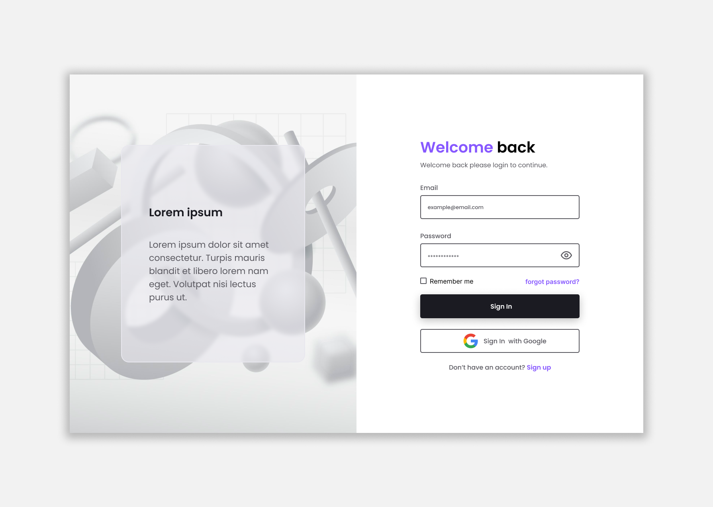

# Login Form

Página web para efetuar login de usuários

## Tecnologias Utilizadas
- [Tailwind](https://tailwindcss.com) - Para Estilização
- [React](https://reactjs.org/) - Biblioteca JS
- [Vite](https://vitejs.dev) - Ferramenta de Desenvolvimento

## Funcionalidades
- Login de usuários: permite que os usuários se conectem com suas contas, inserindo seu endereço de e-mail e senha.

#

[Live Site](https://gilded-torrone-828a5d.netlify.app/)
